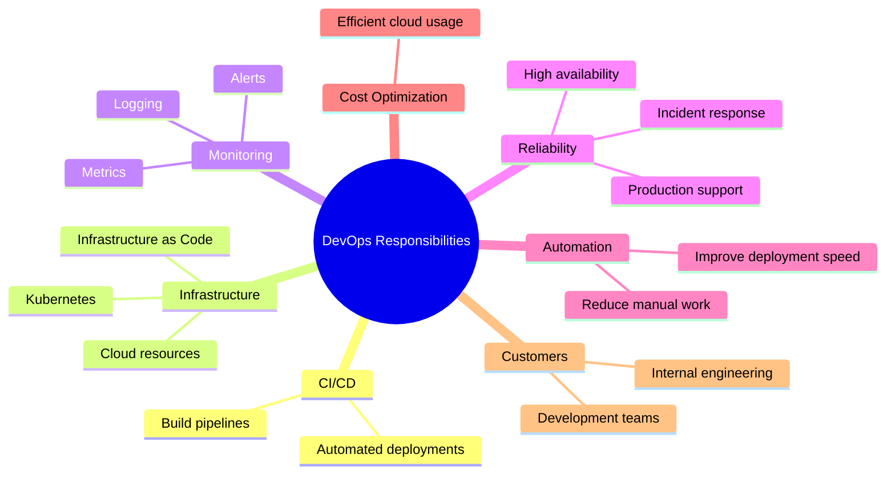

```mermaid
mindmap
    root ((DevOps Responsibilities))
        CI/CD
            Build pipelines
            Automated deployments
        Infrastructure
            Kubernetes
            Cloud resources
            Infrastructure as Code
        Monitoring
            Metrics
            Alerts
            Logging
        Reliability
            Production support
            Incident response
            High availability
        Automation
            Reduce manual work
            Improve deployment speed
        Cost Optimization
            Efficient cloud usage
        Customers
            Development teams
            Internal engineering
```