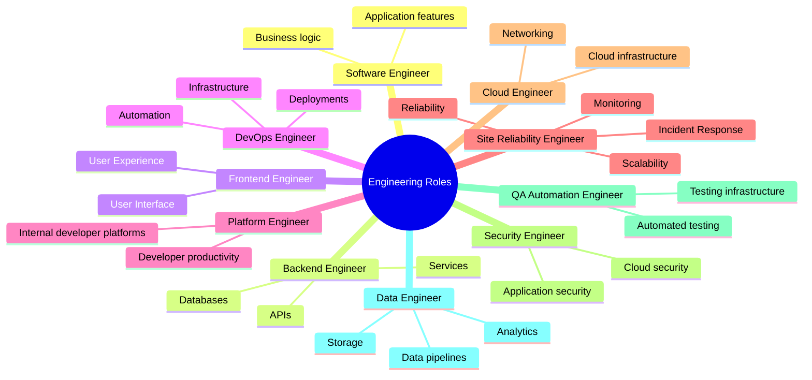

```mermaid
mindmap
    root ((Engineering Roles))
        Software Engineer
            Application features
            Business logic
        Backend Engineer
            APIs
            Databases
            Services
        Frontend Engineer
            User Interface
            User Experience
        DevOps Engineer
            Infrastructure
            Automation
            Deployments
        Platform Engineer
            Internal developer platforms
            Developer productivity
        Site Reliability Engineer
            Reliability
            Scalability
            Monitoring
            Incident Response
        Cloud Engineer
            Cloud infrastructure
            Networking
        Security Engineer
            Cloud security
            Application security
        QA Automation Engineer
            Automated testing
            Testing infrastructure
        Data Engineer
            Data pipelines
            Storage
            Analytics
```