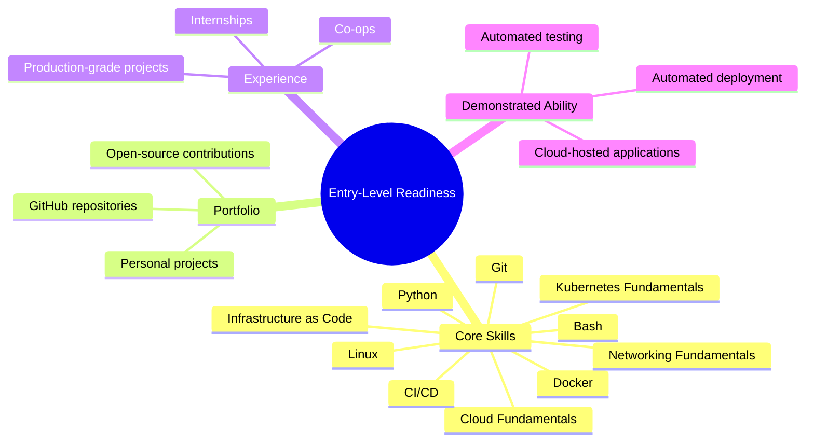

```mermaid
mindmap
    root ((Entry-Level Readiness))
        Core Skills
            Linux
            Git
            Docker
            Kubernetes Fundamentals
            Cloud Fundamentals
            CI/CD
            Bash
            Python
            Networking Fundamentals
            Infrastructure as Code
        Portfolio
            Personal projects
            Open-source contributions
            GitHub repositories
        Experience
            Internships
            Co-ops
            Production-grade projects
        Demonstrated Ability
            Automated testing
            Automated deployment
            Cloud-hosted applications
```