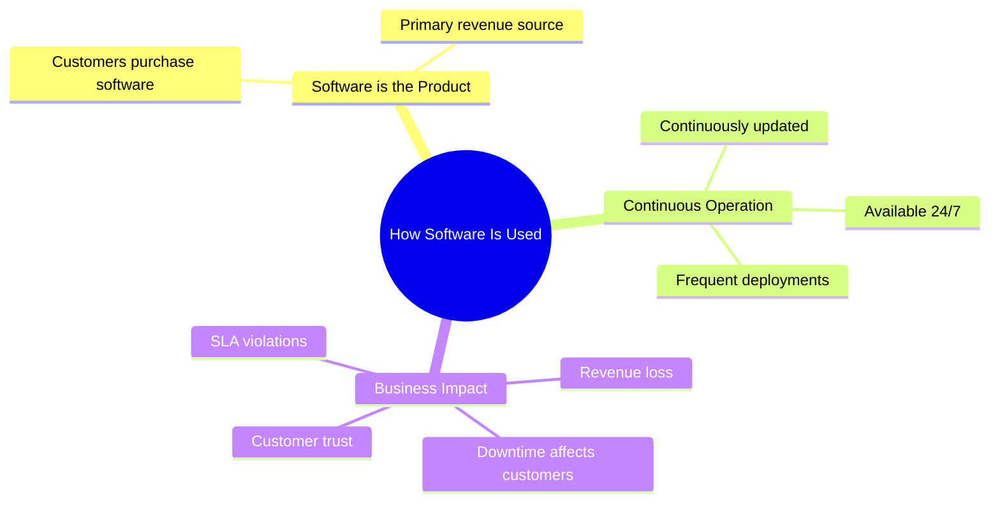

```mermaid
mindmap
    root ((How Software Is Used))
        Software is the Product
            Customers purchase software
            Primary revenue source
        Continuous Operation
            Available 24/7
            Continuously updated
            Frequent deployments
        Business Impact
            Downtime affects customers
            Revenue loss
            SLA violations
            Customer trust
```