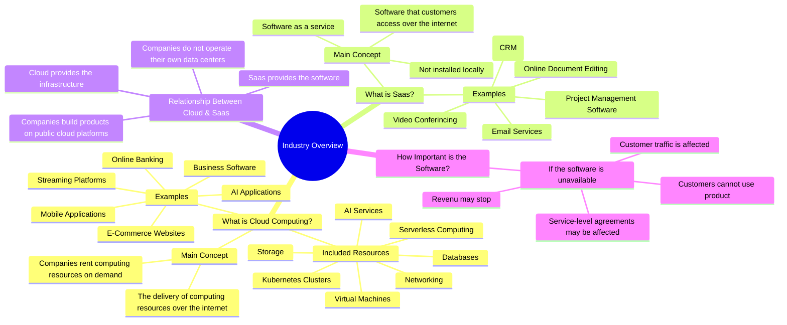

```mermaid
mindmap
    root ((Industry Overview))
        What is Cloud Computing?
            Main Concept
                The delivery of computing resources over the internet
                Companies rent computing resources on demand
            Included Resources
                Virtual Machines
                Storage
                Databases
                Networking
                AI Services
                Kubernetes Clusters
                Serverless Computing
            Examples
                Streaming Platforms
                AI Applications
                Online Banking
                E-Commerce Websites
                Mobile Applications
                Business Software
        What is Saas?
            Main Concept
                Software as a service
                Software that customers access over the internet
                Not installed locally
            Examples
                Email Services
                Project Management Software
                Customer Relationships Management (CRM)
                Video Conferincing
                Online Document Editing
        Relationship Between Cloud & Saas
            Cloud provides the infrastructure
            Saas provides the software
            Companies build products on public cloud platforms
            Companies do not operate their own data centers
        How Important is the Software?
            If the software is unavailable
                Customers cannot use product
                Revenu may stop
                Customer traffic is affected
                Service-level agreements may be affected
```