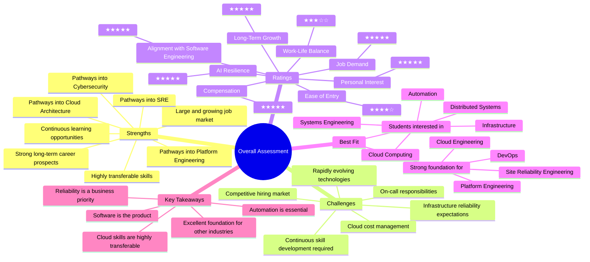

```mermaid
mindmap
    root ((Overall Assessment))
        Strengths
            Large and growing job market
            Highly transferable skills
            Strong long-term career prospects
            Continuous learning opportunities
            Pathways into SRE
            Pathways into Platform Engineering
            Pathways into Cloud Architecture
            Pathways into Cybersecurity
        Challenges
            Competitive hiring market
            Rapidly evolving technologies
            Continuous skill development required
            On-call responsibilities
            Infrastructure reliability expectations
            Cloud cost management
        Ratings
            Personal Interest
                ★★★★★
            Job Demand
                ★★★★★
            Ease of Entry
                ★★★★☆
            Long-Term Growth
                ★★★★★
            Compensation
                ★★★★★
            Work-Life Balance
                ★★★☆☆
            AI Resilience
                ★★★★★
            Alignment with Software Engineering
                ★★★★★
        Best Fit
            Students interested in
                Systems Engineering
                Infrastructure
                Automation
                Cloud Computing
                Distributed Systems
            Strong foundation for
                DevOps
                Site Reliability Engineering
                Platform Engineering
                Cloud Engineering
        Key Takeaways
            Software is the product
            Reliability is a business priority
            Automation is essential
            Cloud skills are highly transferable
            Excellent foundation for other industries
```