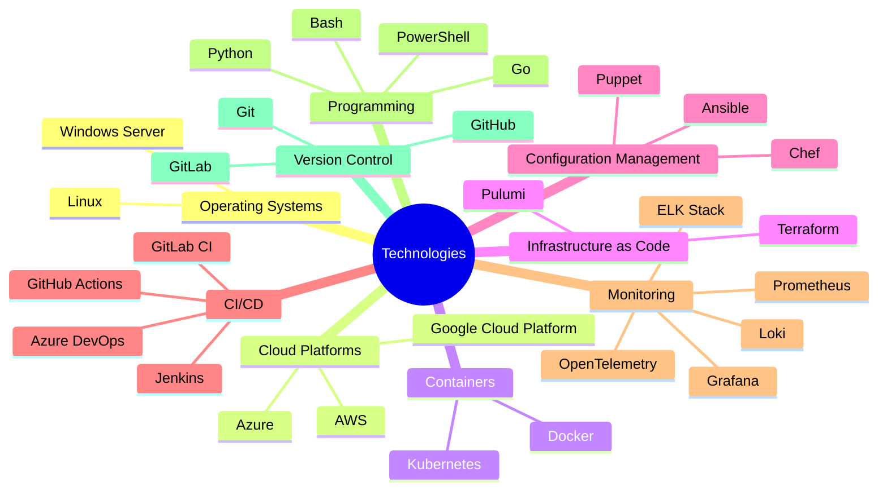

```mermaid
mindmap
    root ((Technologies))
        Operating Systems
            Linux
            Windows Server
        Cloud Platforms
            AWS
            Azure
            Google Cloud Platform
        Containers
            Docker
            Kubernetes
        Infrastructure as Code
            Terraform
            Pulumi
        Configuration Management
            Ansible
            Chef
            Puppet
        CI/CD
            GitHub Actions
            GitLab CI
            Jenkins
            Azure DevOps
        Monitoring
            Prometheus
            Grafana
            OpenTelemetry
            ELK Stack
            Loki
        Programming
            Python
            Go
            Bash
            PowerShell
        Version Control
            Git
            GitHub
            GitLab
```