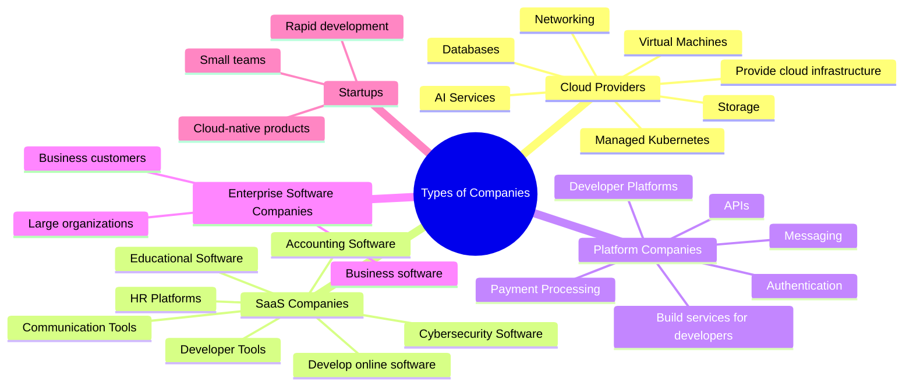

```mermaid
mindmap
    root ((Types of Companies))
        Cloud Providers
            Provide cloud infrastructure
            Virtual Machines
            Storage
            Databases
            Networking
            Managed Kubernetes
            AI Services
        SaaS Companies
            Develop online software
            Accounting Software
            HR Platforms
            Communication Tools
            Developer Tools
            Cybersecurity Software
            Educational Software
        Platform Companies
            Build services for developers
            Authentication
            Payment Processing
            Messaging
            APIs
            Developer Platforms
        Enterprise Software Companies
            Business software
            Large organizations
            Business customers
        Startups
            Cloud-native products
            Small teams
            Rapid development
```