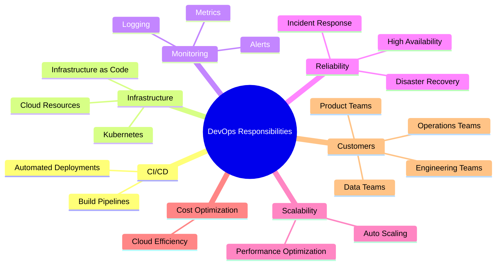

```mermaid
mindmap
    root ((DevOps Responsibilities))
        CI/CD
            Build Pipelines
            Automated Deployments
        Infrastructure
            Kubernetes
            Cloud Resources
            Infrastructure as Code
        Monitoring
            Metrics
            Logging
            Alerts
        Reliability
            High Availability
            Disaster Recovery
            Incident Response
        Scalability
            Auto Scaling
            Performance Optimization
        Cost Optimization
            Cloud Efficiency
        Customers
            Engineering Teams
            Product Teams
            Data Teams
            Operations Teams
```