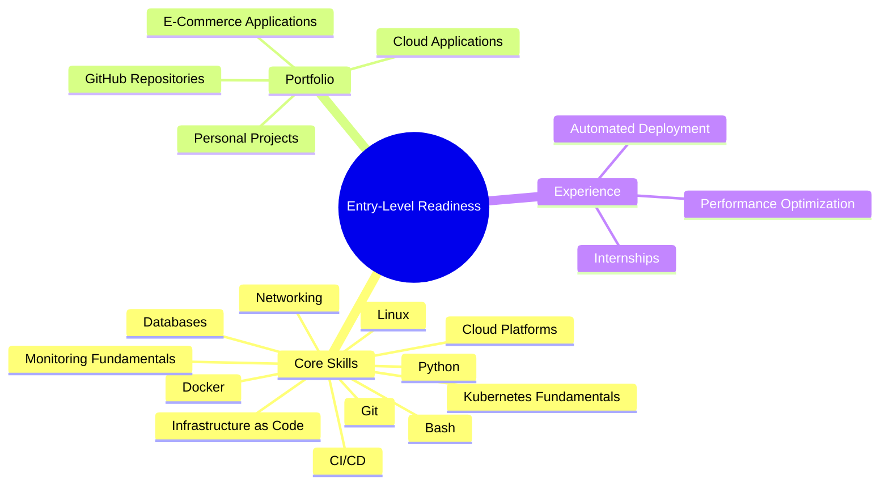

```mermaid
mindmap
    root ((Entry-Level Readiness))
        Core Skills
            Linux
            Git
            Docker
            Kubernetes Fundamentals
            Cloud Platforms
            CI/CD
            Networking
            Infrastructure as Code
            Monitoring Fundamentals
            Databases
            Bash
            Python
        Portfolio
            Personal Projects
            Cloud Applications
            E-Commerce Applications
            GitHub Repositories
        Experience
            Internships
            Automated Deployment
            Performance Optimization
```