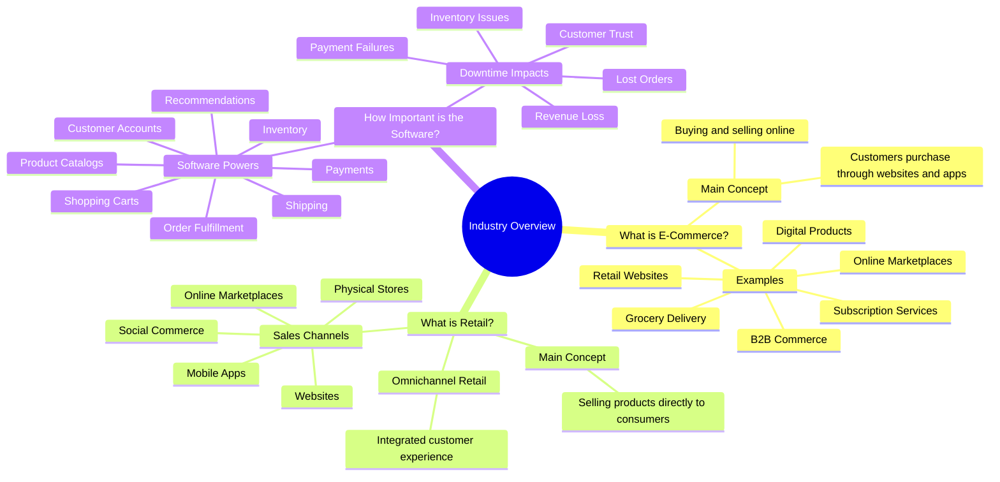

```mermaid
mindmap
    root ((Industry Overview))
        What is E-Commerce?
            Main Concept
                Buying and selling online
                Customers purchase through websites and apps
            Examples
                Online Marketplaces
                Retail Websites
                Grocery Delivery
                Subscription Services
                Digital Products
                B2B Commerce
        What is Retail?
            Main Concept
                Selling products directly to consumers
            Sales Channels
                Physical Stores
                Websites
                Mobile Apps
                Online Marketplaces
                Social Commerce
            Omnichannel Retail
                Integrated customer experience
        How Important is the Software?
            Software Powers
                Product Catalogs
                Shopping Carts
                Payments
                Inventory
                Order Fulfillment
                Shipping
                Customer Accounts
                Recommendations
            Downtime Impacts
                Lost Orders
                Payment Failures
                Inventory Issues
                Revenue Loss
                Customer Trust
```