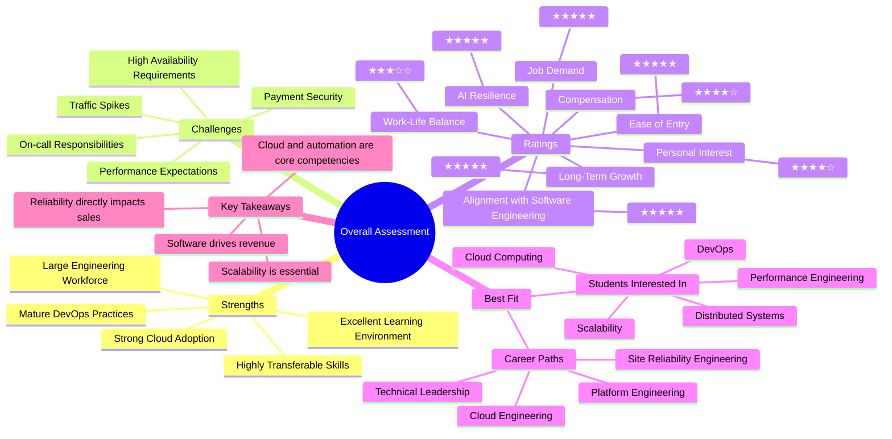

```mermaid
mindmap
    root ((Overall Assessment))
        Strengths
            Large Engineering Workforce
            Mature DevOps Practices
            Strong Cloud Adoption
            Highly Transferable Skills
            Excellent Learning Environment
        Challenges
            Traffic Spikes
            High Availability Requirements
            Payment Security
            On-call Responsibilities
            Performance Expectations
        Ratings
            Personal Interest
                ★★★★☆
            Job Demand
                ★★★★★
            Ease of Entry
                ★★★★★
            Long-Term Growth
                ★★★★★
            Compensation
                ★★★★☆
            Work-Life Balance
                ★★★☆☆
            AI Resilience
                ★★★★★
            Alignment with Software Engineering
                ★★★★★
        Best Fit
            Students Interested In
                Cloud Computing
                Distributed Systems
                Scalability
                Performance Engineering
                DevOps
            Career Paths
                Platform Engineering
                Site Reliability Engineering
                Cloud Engineering
                Technical Leadership
        Key Takeaways
            Software drives revenue
            Reliability directly impacts sales
            Scalability is essential
            Cloud and automation are core competencies
```