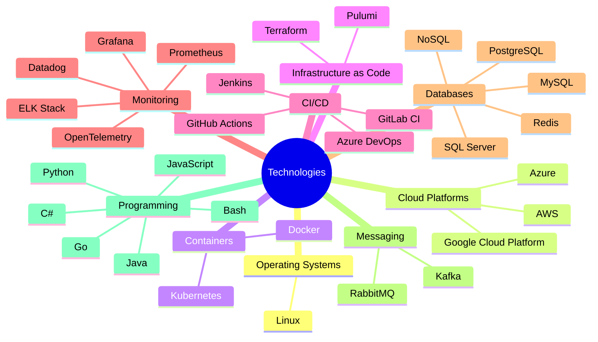

```mermaid
mindmap
    root ((Technologies))
        Operating Systems
            Linux
        Cloud Platforms
            AWS
            Azure
            Google Cloud Platform
        Containers
            Docker
            Kubernetes
        Infrastructure as Code
            Terraform
            Pulumi
        CI/CD
            GitHub Actions
            GitLab CI
            Jenkins
            Azure DevOps
        Monitoring
            Prometheus
            Grafana
            OpenTelemetry
            ELK Stack
            Datadog
        Databases
            PostgreSQL
            MySQL
            SQL Server
            NoSQL
            Redis
        Messaging
            Kafka
            RabbitMQ
        Programming
            Java
            Go
            Python
            JavaScript
            C#
            Bash
```