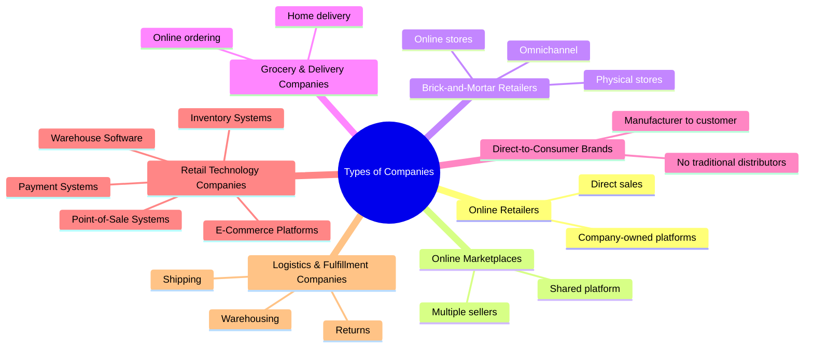

```mermaid
mindmap
    root ((Types of Companies))
        Online Retailers
            Direct sales
            Company-owned platforms
        Online Marketplaces
            Multiple sellers
            Shared platform
        Brick-and-Mortar Retailers
            Physical stores
            Online stores
            Omnichannel
        Grocery & Delivery Companies
            Online ordering
            Home delivery
        Direct-to-Consumer Brands
            Manufacturer to customer
            No traditional distributors
        Retail Technology Companies
            Point-of-Sale Systems
            Inventory Systems
            E-Commerce Platforms
            Warehouse Software
            Payment Systems
        Logistics & Fulfillment Companies
            Warehousing
            Shipping
            Returns
```