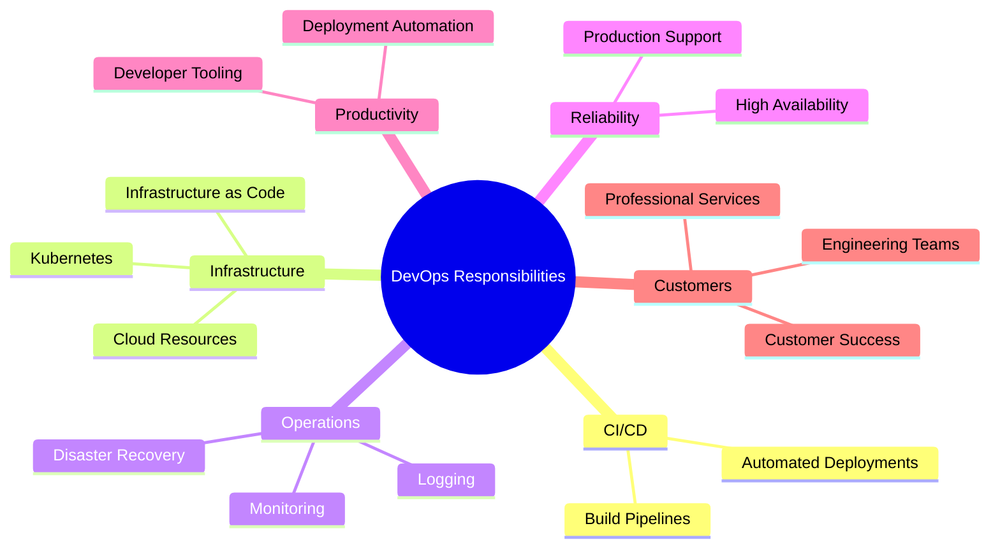

```mermaid
mindmap
    root ((DevOps Responsibilities))
        CI/CD
            Build Pipelines
            Automated Deployments
        Infrastructure
            Kubernetes
            Infrastructure as Code
            Cloud Resources
        Operations
            Monitoring
            Logging
            Disaster Recovery
        Reliability
            Production Support
            High Availability
        Productivity
            Developer Tooling
            Deployment Automation
        Customers
            Engineering Teams
            Customer Success
            Professional Services
```