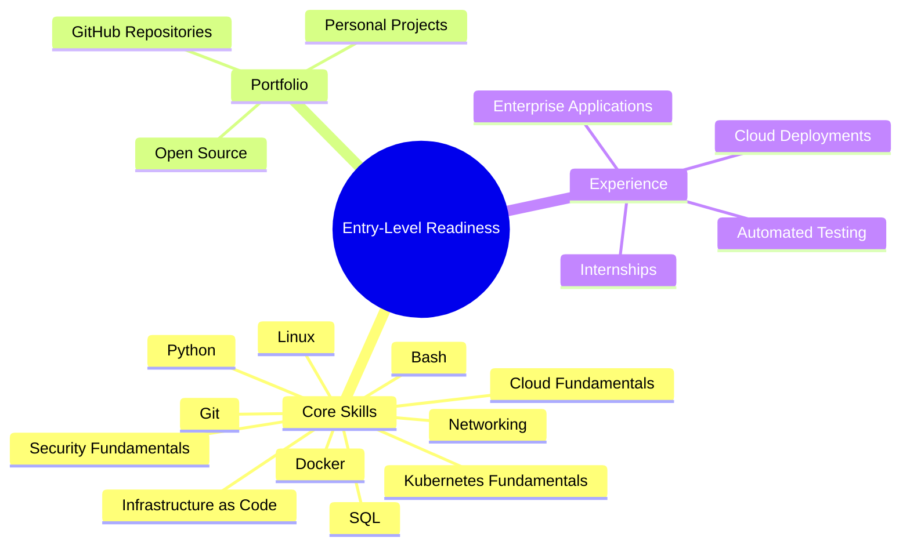

```mermaid
mindmap
    root ((Entry-Level Readiness))
        Core Skills
            Linux
            Git
            Docker
            Kubernetes Fundamentals
            Cloud Fundamentals
            Networking
            SQL
            Bash
            Python
            Infrastructure as Code
            Security Fundamentals
        Portfolio
            Personal Projects
            Open Source
            GitHub Repositories
        Experience
            Internships
            Enterprise Applications
            Cloud Deployments
            Automated Testing
```