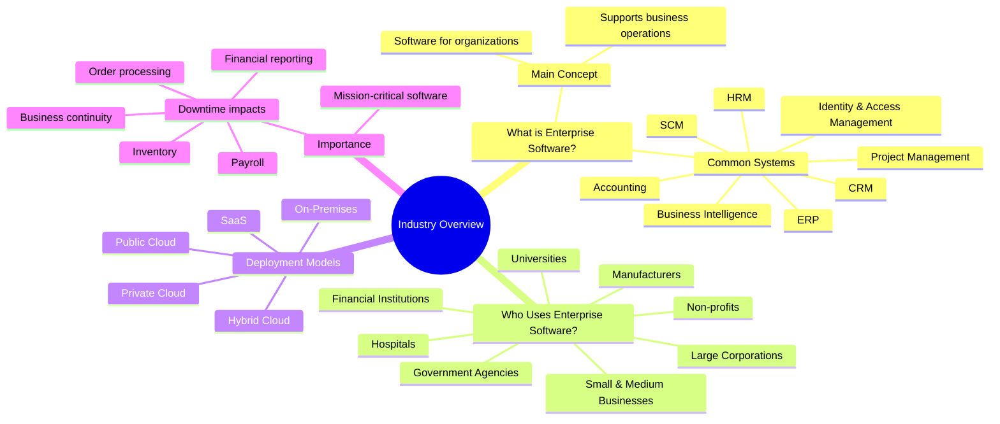

```mermaid
mindmap
    root ((Industry Overview))
        What is Enterprise Software?
            Main Concept
                Software for organizations
                Supports business operations
            Common Systems
                ERP
                CRM
                HRM
                SCM
                Accounting
                Identity & Access Management
                Business Intelligence
                Project Management
        Who Uses Enterprise Software?
            Large Corporations
            Small & Medium Businesses
            Government Agencies
            Universities
            Hospitals
            Manufacturers
            Financial Institutions
            Non-profits
        Deployment Models
            On-Premises
            Private Cloud
            Public Cloud
            Hybrid Cloud
            SaaS
        Importance
            Mission-critical software
            Downtime impacts
                Order processing
                Payroll
                Inventory
                Financial reporting
                Business continuity
```