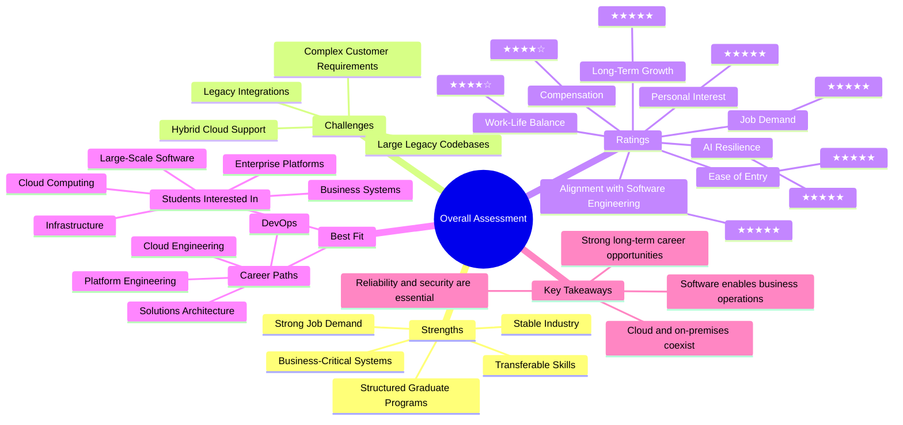

```mermaid
mindmap
    root ((Overall Assessment))
        Strengths
            Stable Industry
            Strong Job Demand
            Transferable Skills
            Structured Graduate Programs
            Business-Critical Systems
        Challenges
            Large Legacy Codebases
            Legacy Integrations
            Complex Customer Requirements
            Hybrid Cloud Support
        Ratings
            Personal Interest
                ★★★★★
            Job Demand
                ★★★★★
            Ease of Entry
                ★★★★★
            Long-Term Growth
                ★★★★★
            Compensation
                ★★★★☆
            Work-Life Balance
                ★★★★☆
            AI Resilience
                ★★★★★
            Alignment with Software Engineering
                ★★★★★
        Best Fit
            Students Interested In
                Business Systems
                Cloud Computing
                Infrastructure
                Enterprise Platforms
                Large-Scale Software
            Career Paths
                DevOps
                Platform Engineering
                Cloud Engineering
                Solutions Architecture
        Key Takeaways
            Software enables business operations
            Reliability and security are essential
            Cloud and on-premises coexist
            Strong long-term career opportunities
```