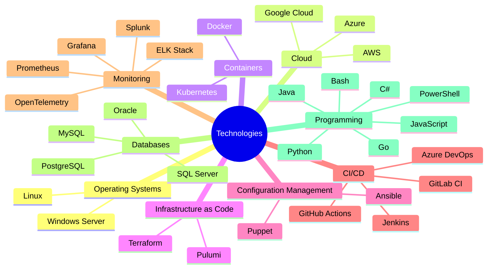

```mermaid
mindmap
    root ((Technologies))
        Operating Systems
            Linux
            Windows Server
        Cloud
            AWS
            Azure
            Google Cloud
        Containers
            Docker
            Kubernetes
        Infrastructure as Code
            Terraform
            Pulumi
        Configuration Management
            Ansible
            Puppet
        CI/CD
            GitHub Actions
            GitLab CI
            Jenkins
            Azure DevOps
        Monitoring
            Prometheus
            Grafana
            OpenTelemetry
            ELK Stack
            Splunk
        Databases
            PostgreSQL
            MySQL
            SQL Server
            Oracle
        Programming
            Java
            C#
            Python
            Go
            JavaScript
            Bash
            PowerShell
```