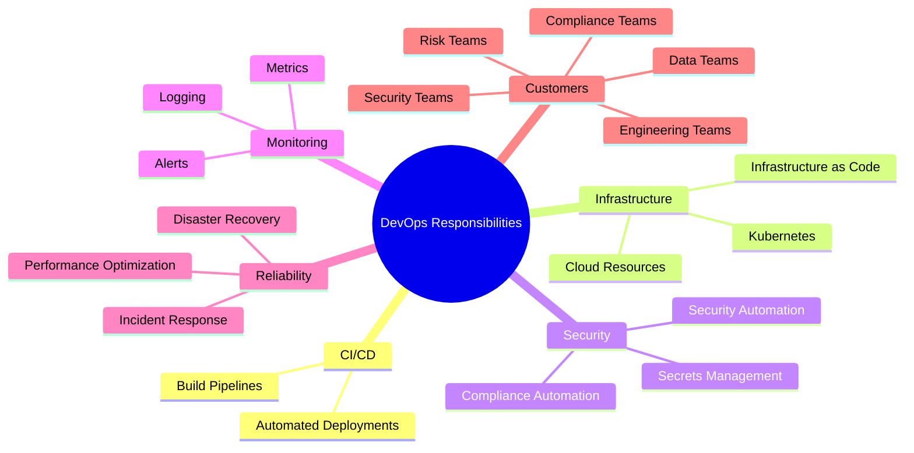

```mermaid
mindmap
    root ((DevOps Responsibilities))
        CI/CD
            Build Pipelines
            Automated Deployments
        Infrastructure
            Kubernetes
            Cloud Resources
            Infrastructure as Code
        Security
            Security Automation
            Secrets Management
            Compliance Automation
        Monitoring
            Metrics
            Logging
            Alerts
        Reliability
            Disaster Recovery
            Incident Response
            Performance Optimization
        Customers
            Engineering Teams
            Security Teams
            Risk Teams
            Compliance Teams
            Data Teams
```