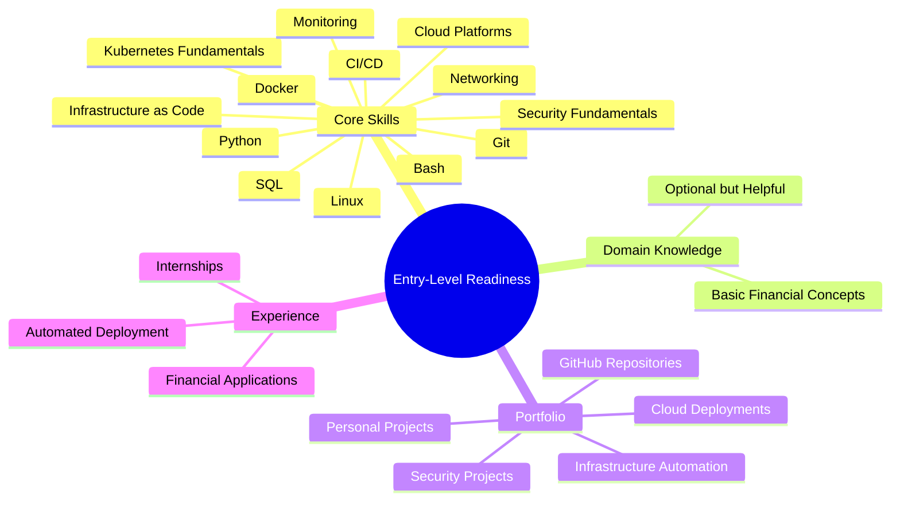

```mermaid
mindmap
    root ((Entry-Level Readiness))
        Core Skills
            Linux
            Git
            Docker
            Kubernetes Fundamentals
            Cloud Platforms
            CI/CD
            Networking
            Infrastructure as Code
            Monitoring
            SQL
            Bash
            Python
            Security Fundamentals
        Domain Knowledge
            Basic Financial Concepts
            Optional but Helpful
        Portfolio
            Personal Projects
            Security Projects
            Infrastructure Automation
            Cloud Deployments
            GitHub Repositories
        Experience
            Internships
            Automated Deployment
            Financial Applications
```