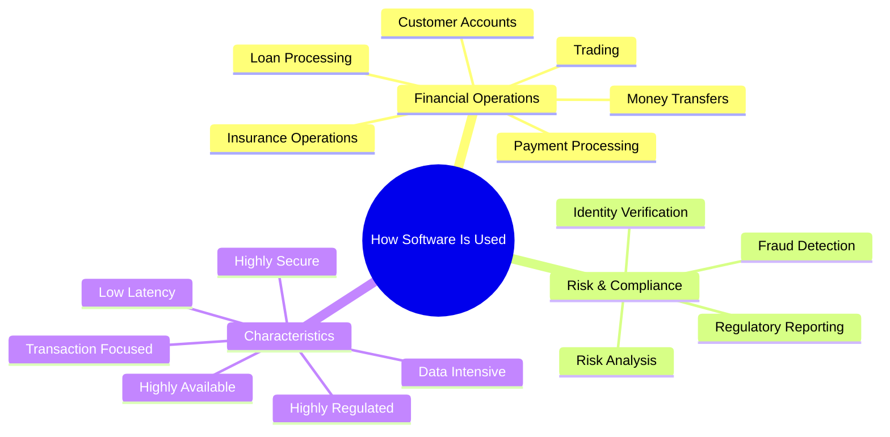

```mermaid
mindmap
    root ((How Software Is Used))
        Financial Operations
            Customer Accounts
            Money Transfers
            Trading
            Payment Processing
            Loan Processing
            Insurance Operations
        Risk & Compliance
            Fraud Detection
            Risk Analysis
            Identity Verification
            Regulatory Reporting
        Characteristics
            Highly Secure
            Transaction Focused
            Low Latency
            Highly Available
            Highly Regulated
            Data Intensive
```