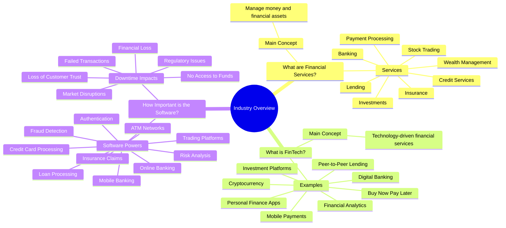

```mermaid
mindmap
    root ((Industry Overview))
        What are Financial Services?
            Main Concept
                Manage money and financial assets
            Services
                Banking
                Investments
                Wealth Management
                Insurance
                Payment Processing
                Lending
                Credit Services
                Stock Trading
        What is FinTech?
            Main Concept
                Technology-driven financial services
            Examples
                Digital Banking
                Mobile Payments
                Investment Platforms
                Peer-to-Peer Lending
                Cryptocurrency
                Financial Analytics
                Personal Finance Apps
                Buy Now Pay Later
        How Important is the Software?
            Software Powers
                Online Banking
                ATM Networks
                Credit Card Processing
                Mobile Banking
                Trading Platforms
                Fraud Detection
                Risk Analysis
                Authentication
                Loan Processing
                Insurance Claims
            Downtime Impacts
                No Access to Funds
                Failed Transactions
                Market Disruptions
                Regulatory Issues
                Financial Loss
                Loss of Customer Trust
```