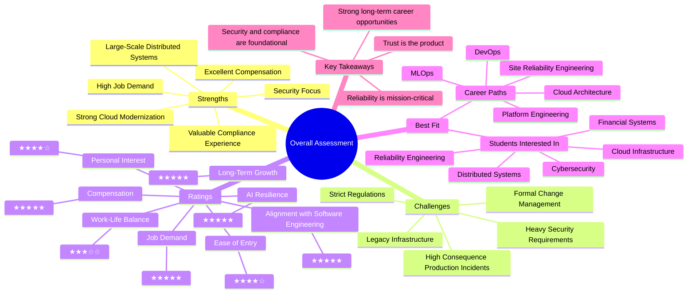

```mermaid
mindmap
    root ((Overall Assessment))
        Strengths
            Excellent Compensation
            High Job Demand
            Strong Cloud Modernization
            Security Focus
            Valuable Compliance Experience
            Large-Scale Distributed Systems
        Challenges
            Strict Regulations
            Heavy Security Requirements
            Formal Change Management
            High Consequence Production Incidents
            Legacy Infrastructure
        Ratings
            Personal Interest
                ★★★★☆
            Job Demand
                ★★★★★
            Ease of Entry
                ★★★★☆
            Long-Term Growth
                ★★★★★
            Compensation
                ★★★★★
            Work-Life Balance
                ★★★☆☆
            AI Resilience
                ★★★★★
            Alignment with Software Engineering
                ★★★★★
        Best Fit
            Students Interested In
                Cloud Infrastructure
                Cybersecurity
                Distributed Systems
                Reliability Engineering
                Financial Systems
            Career Paths
                DevOps
                Platform Engineering
                Site Reliability Engineering
                Cloud Architecture
                MLOps
        Key Takeaways
            Trust is the product
            Security and compliance are foundational
            Reliability is mission-critical
            Strong long-term career opportunities
```