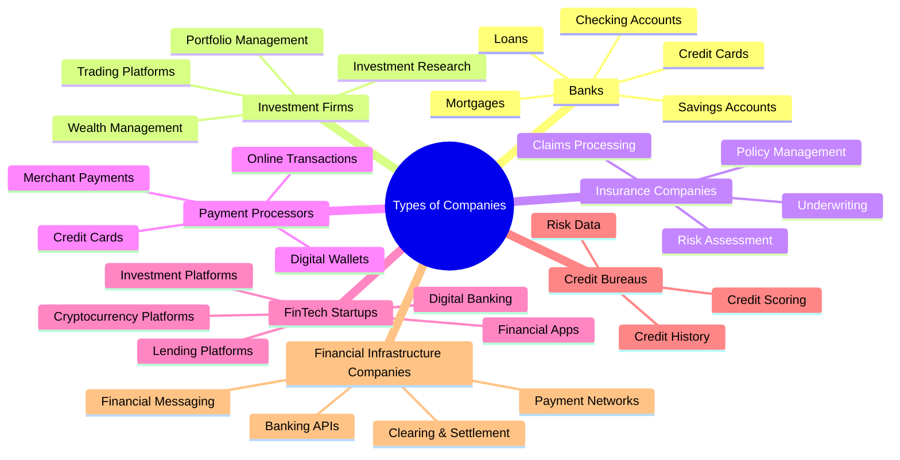

```mermaid
mindmap
    root ((Types of Companies))
        Banks
            Checking Accounts
            Savings Accounts
            Loans
            Mortgages
            Credit Cards
        Investment Firms
            Trading Platforms
            Portfolio Management
            Wealth Management
            Investment Research
        Insurance Companies
            Claims Processing
            Underwriting
            Policy Management
            Risk Assessment
        Payment Processors
            Credit Cards
            Digital Wallets
            Merchant Payments
            Online Transactions
        FinTech Startups
            Digital Banking
            Financial Apps
            Investment Platforms
            Lending Platforms
            Cryptocurrency Platforms
        Credit Bureaus
            Credit History
            Credit Scoring
            Risk Data
        Financial Infrastructure Companies
            Payment Networks
            Banking APIs
            Financial Messaging
            Clearing & Settlement
```