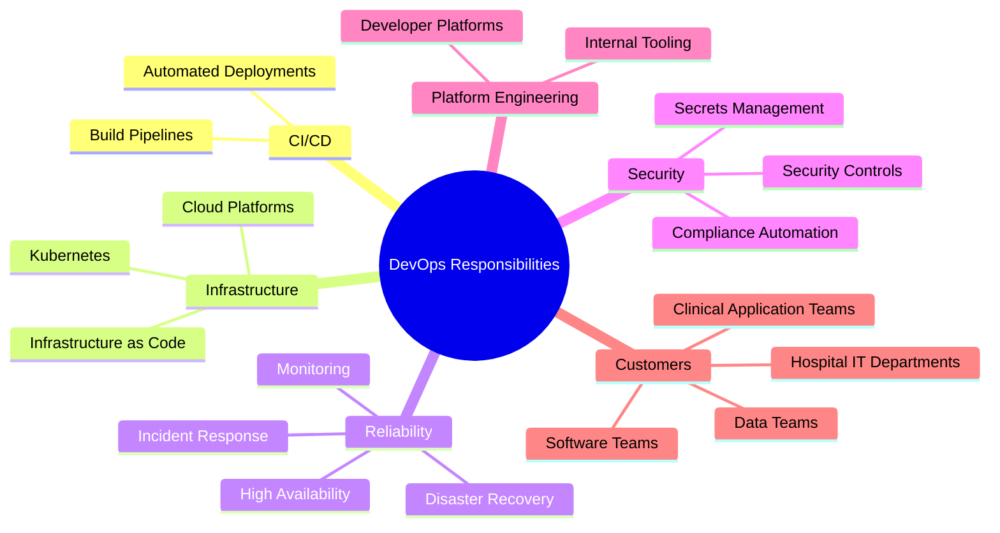

```mermaid
mindmap
    root ((DevOps Responsibilities))
        CI/CD
            Build Pipelines
            Automated Deployments
        Infrastructure
            Cloud Platforms
            Kubernetes
            Infrastructure as Code
        Reliability
            Monitoring
            Disaster Recovery
            Incident Response
            High Availability
        Security
            Compliance Automation
            Secrets Management
            Security Controls
        Platform Engineering
            Developer Platforms
            Internal Tooling
        Customers
            Software Teams
            Clinical Application Teams
            Data Teams
            Hospital IT Departments
```