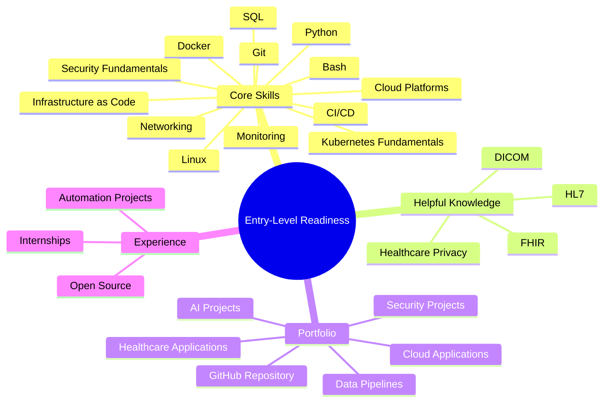

```mermaid
mindmap
    root ((Entry-Level Readiness))
        Core Skills
            Linux
            Git
            Docker
            Kubernetes Fundamentals
            Cloud Platforms
            CI/CD
            Networking
            Infrastructure as Code
            Monitoring
            SQL
            Bash
            Python
            Security Fundamentals
        Helpful Knowledge
            HL7
            FHIR
            DICOM
            Healthcare Privacy
        Portfolio
            Cloud Applications
            Healthcare Applications
            Security Projects
            Data Pipelines
            AI Projects
            GitHub Repository
        Experience
            Internships
            Open Source
            Automation Projects
```