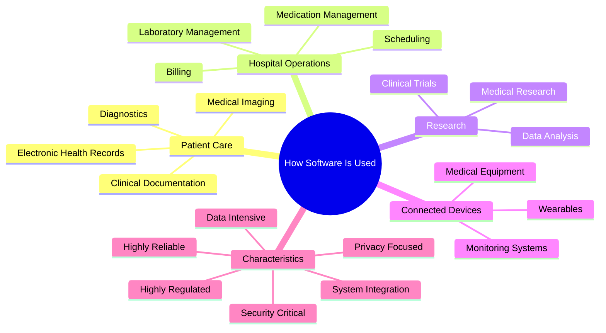

```mermaid
mindmap
    root ((How Software Is Used))
        Patient Care
            Electronic Health Records
            Clinical Documentation
            Medical Imaging
            Diagnostics
        Hospital Operations
            Scheduling
            Billing
            Laboratory Management
            Medication Management
        Research
            Clinical Trials
            Data Analysis
            Medical Research
        Connected Devices
            Wearables
            Monitoring Systems
            Medical Equipment
        Characteristics
            Highly Reliable
            Privacy Focused
            Security Critical
            Highly Regulated
            Data Intensive
            System Integration
```