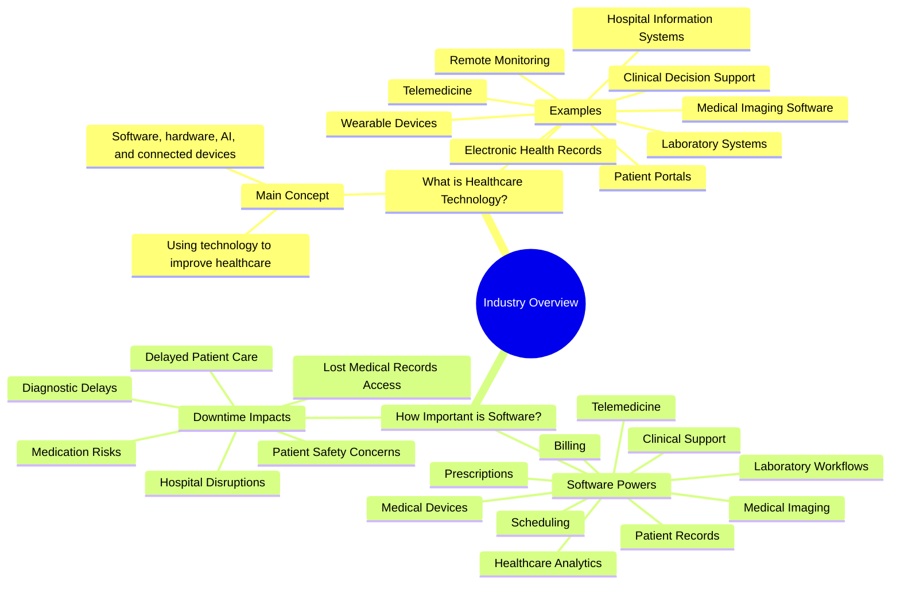

```mermaid
mindmap
    root ((Industry Overview))
        What is Healthcare Technology?
            Main Concept
                Using technology to improve healthcare
                Software, hardware, AI, and connected devices
            Examples
                Electronic Health Records
                Hospital Information Systems
                Medical Imaging Software
                Telemedicine
                Clinical Decision Support
                Laboratory Systems
                Patient Portals
                Wearable Devices
                Remote Monitoring
        How Important is Software?
            Software Powers
                Patient Records
                Scheduling
                Medical Imaging
                Prescriptions
                Laboratory Workflows
                Billing
                Telemedicine
                Clinical Support
                Medical Devices
                Healthcare Analytics
            Downtime Impacts
                Delayed Patient Care
                Lost Medical Records Access
                Medication Risks
                Diagnostic Delays
                Hospital Disruptions
                Patient Safety Concerns
```