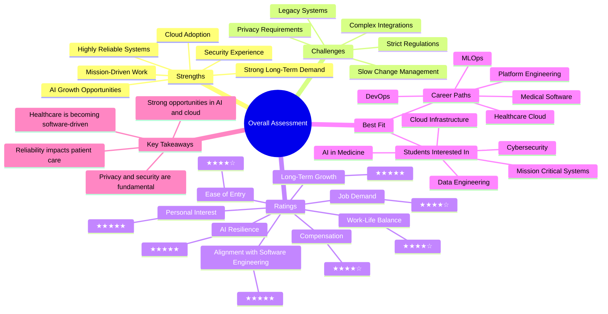

```mermaid
mindmap
    root ((Overall Assessment))
        Strengths
            Mission-Driven Work
            Strong Long-Term Demand
            AI Growth Opportunities
            Cloud Adoption
            Security Experience
            Highly Reliable Systems
        Challenges
            Strict Regulations
            Privacy Requirements
            Legacy Systems
            Complex Integrations
            Slow Change Management
        Ratings
            Personal Interest
                ★★★★★
            Job Demand
                ★★★★☆
            Ease of Entry
                ★★★★☆
            Long-Term Growth
                ★★★★★
            Compensation
                ★★★★☆
            Work-Life Balance
                ★★★★☆
            AI Resilience
                ★★★★★
            Alignment with Software Engineering
                ★★★★★
        Best Fit
            Students Interested In
                AI in Medicine
                Cloud Infrastructure
                Cybersecurity
                Data Engineering
                Mission Critical Systems
            Career Paths
                DevOps
                Platform Engineering
                Healthcare Cloud
                MLOps
                Medical Software
        Key Takeaways
            Reliability impacts patient care
            Privacy and security are fundamental
            Healthcare is becoming software-driven
            Strong opportunities in AI and cloud
```