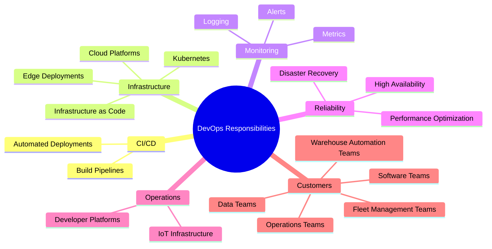

```mermaid
mindmap
    root ((DevOps Responsibilities))
        CI/CD
            Build Pipelines
            Automated Deployments
        Infrastructure
            Cloud Platforms
            Kubernetes
            Infrastructure as Code
            Edge Deployments
        Monitoring
            Metrics
            Logging
            Alerts
        Reliability
            Disaster Recovery
            High Availability
            Performance Optimization
        Operations
            IoT Infrastructure
            Developer Platforms
        Customers
            Software Teams
            Warehouse Automation Teams
            Fleet Management Teams
            Data Teams
            Operations Teams
```