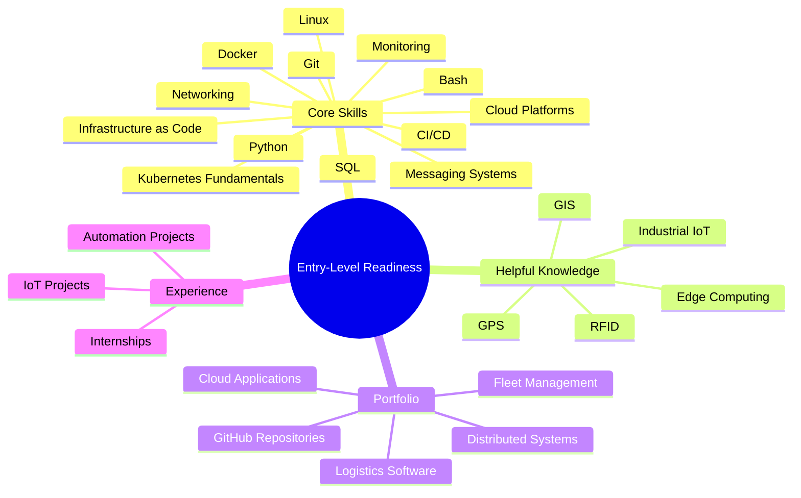

```mermaid
mindmap
    root ((Entry-Level Readiness))
        Core Skills
            Linux
            Git
            Docker
            Kubernetes Fundamentals
            Cloud Platforms
            CI/CD
            Networking
            Infrastructure as Code
            Monitoring
            SQL
            Bash
            Python
            Messaging Systems
        Helpful Knowledge
            GPS
            GIS
            RFID
            Industrial IoT
            Edge Computing
        Portfolio
            Cloud Applications
            Logistics Software
            Fleet Management
            Distributed Systems
            GitHub Repositories
        Experience
            Internships
            Automation Projects
            IoT Projects
```