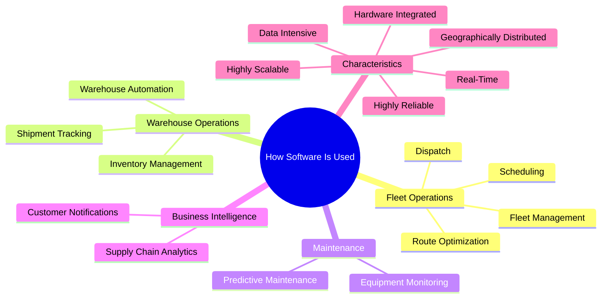

```mermaid
mindmap
    root ((How Software Is Used))
        Fleet Operations
            Fleet Management
            Route Optimization
            Dispatch
            Scheduling
        Warehouse Operations
            Warehouse Automation
            Inventory Management
            Shipment Tracking
        Maintenance
            Predictive Maintenance
            Equipment Monitoring
        Business Intelligence
            Supply Chain Analytics
            Customer Notifications
        Characteristics
            Real-Time
            Highly Scalable
            Hardware Integrated
            Data Intensive
            Geographically Distributed
            Highly Reliable
```