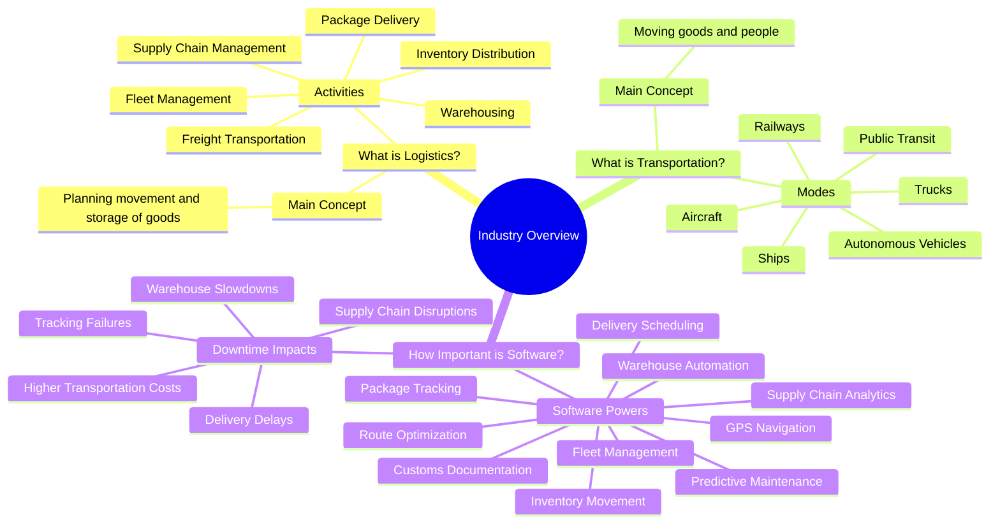

```mermaid
mindmap
    root ((Industry Overview))
        What is Logistics?
            Main Concept
                Planning movement and storage of goods
            Activities
                Warehousing
                Freight Transportation
                Package Delivery
                Supply Chain Management
                Fleet Management
                Inventory Distribution
        What is Transportation?
            Main Concept
                Moving goods and people
            Modes
                Trucks
                Ships
                Aircraft
                Railways
                Public Transit
                Autonomous Vehicles
        How Important is Software?
            Software Powers
                Route Optimization
                Warehouse Automation
                Package Tracking
                Fleet Management
                GPS Navigation
                Delivery Scheduling
                Inventory Movement
                Customs Documentation
                Supply Chain Analytics
                Predictive Maintenance
            Downtime Impacts
                Delivery Delays
                Tracking Failures
                Warehouse Slowdowns
                Higher Transportation Costs
                Supply Chain Disruptions
```