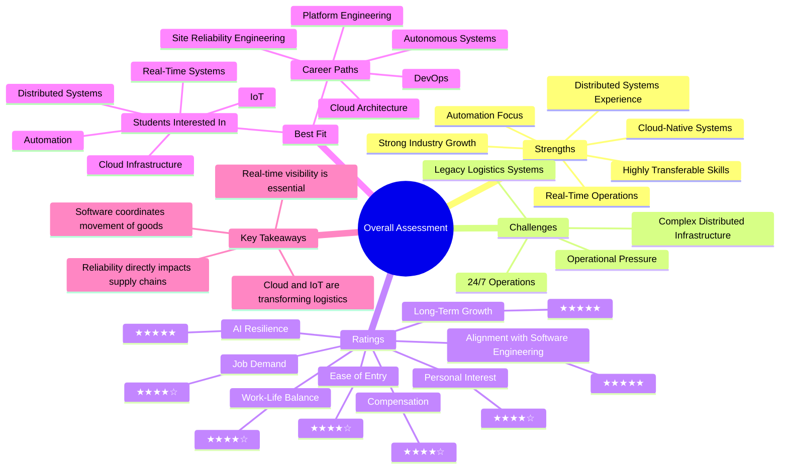

```mermaid
mindmap
    root ((Overall Assessment))
        Strengths
            Strong Industry Growth
            Cloud-Native Systems
            Real-Time Operations
            Automation Focus
            Distributed Systems Experience
            Highly Transferable Skills
        Challenges
            24/7 Operations
            Legacy Logistics Systems
            Complex Distributed Infrastructure
            Operational Pressure
        Ratings
            Personal Interest
                ★★★★☆
            Job Demand
                ★★★★☆
            Ease of Entry
                ★★★★☆
            Long-Term Growth
                ★★★★★
            Compensation
                ★★★★☆
            Work-Life Balance
                ★★★★☆
            AI Resilience
                ★★★★★
            Alignment with Software Engineering
                ★★★★★
        Best Fit
            Students Interested In
                Cloud Infrastructure
                Distributed Systems
                Automation
                IoT
                Real-Time Systems
            Career Paths
                DevOps
                Platform Engineering
                Site Reliability Engineering
                Cloud Architecture
                Autonomous Systems
        Key Takeaways
            Software coordinates movement of goods
            Reliability directly impacts supply chains
            Real-time visibility is essential
            Cloud and IoT are transforming logistics
```