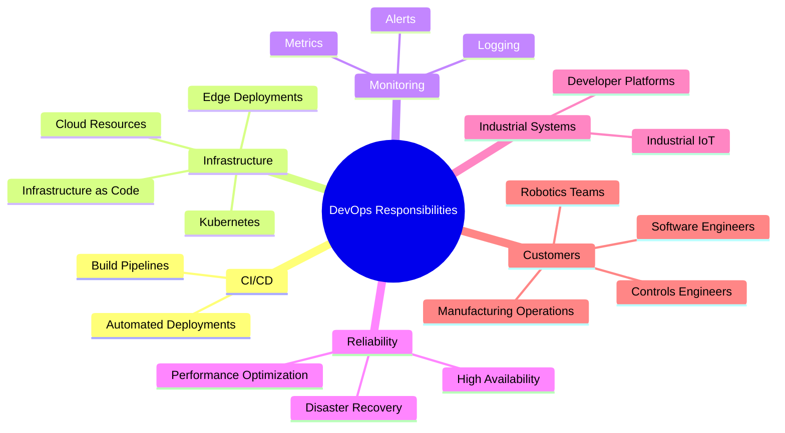

```mermaid
mindmap
    root ((DevOps Responsibilities))
        CI/CD
            Build Pipelines
            Automated Deployments
        Infrastructure
            Kubernetes
            Cloud Resources
            Infrastructure as Code
            Edge Deployments
        Monitoring
            Metrics
            Logging
            Alerts
        Reliability
            Disaster Recovery
            Performance Optimization
            High Availability
        Industrial Systems
            Industrial IoT
            Developer Platforms
        Customers
            Software Engineers
            Controls Engineers
            Robotics Teams
            Manufacturing Operations
```