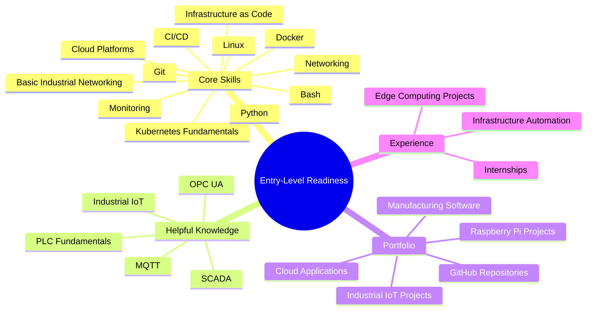

```mermaid
mindmap
    root ((Entry-Level Readiness))
        Core Skills
            Linux
            Git
            Docker
            Kubernetes Fundamentals
            Cloud Platforms
            CI/CD
            Networking
            Infrastructure as Code
            Monitoring
            Bash
            Python
            Basic Industrial Networking
        Helpful Knowledge
            PLC Fundamentals
            SCADA
            OPC UA
            MQTT
            Industrial IoT
        Portfolio
            Manufacturing Software
            Industrial IoT Projects
            Raspberry Pi Projects
            Cloud Applications
            GitHub Repositories
        Experience
            Internships
            Infrastructure Automation
            Edge Computing Projects
```