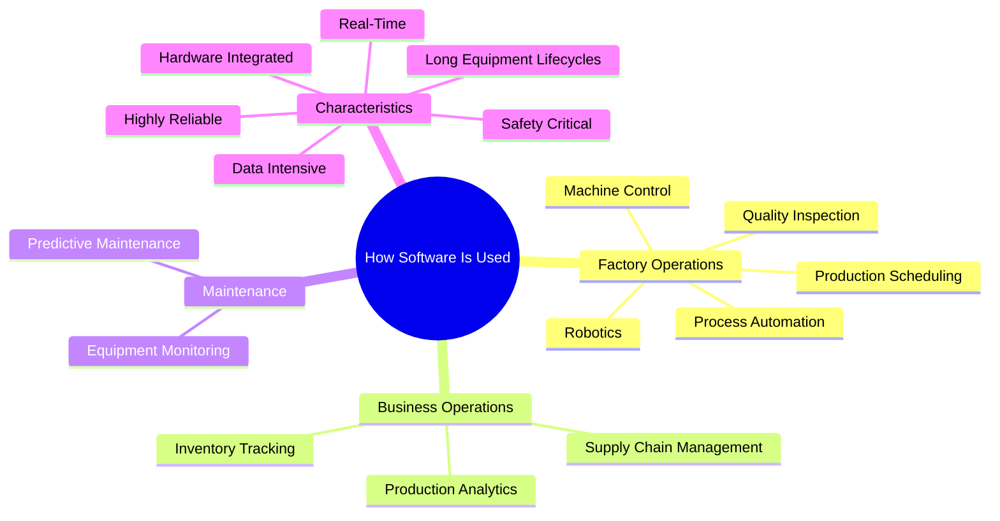

```mermaid
mindmap
    root ((How Software Is Used))
        Factory Operations
            Machine Control
            Robotics
            Process Automation
            Production Scheduling
            Quality Inspection
        Business Operations
            Inventory Tracking
            Supply Chain Management
            Production Analytics
        Maintenance
            Predictive Maintenance
            Equipment Monitoring
        Characteristics
            Real-Time
            Safety Critical
            Hardware Integrated
            Highly Reliable
            Data Intensive
            Long Equipment Lifecycles
```