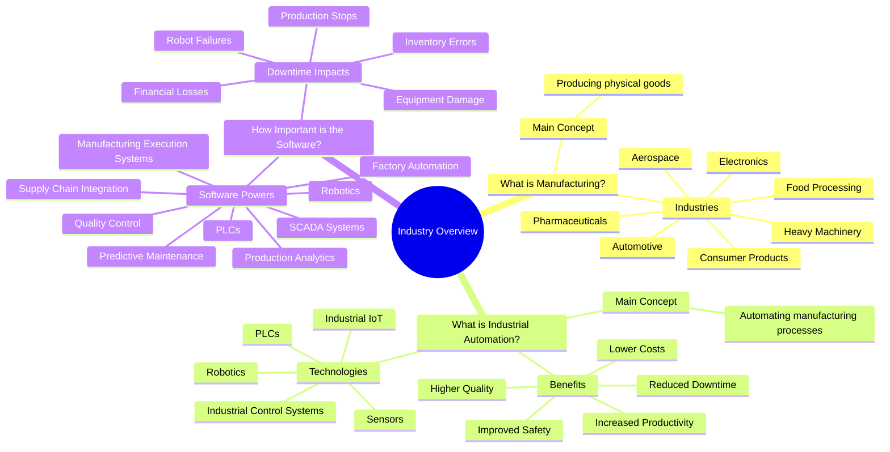

```mermaid
mindmap
    root ((Industry Overview))
        What is Manufacturing?
            Main Concept
                Producing physical goods
            Industries
                Automotive
                Aerospace
                Electronics
                Food Processing
                Pharmaceuticals
                Consumer Products
                Heavy Machinery
        What is Industrial Automation?
            Main Concept
                Automating manufacturing processes
            Technologies
                Robotics
                PLCs
                Sensors
                Industrial Control Systems
                Industrial IoT
            Benefits
                Increased Productivity
                Higher Quality
                Improved Safety
                Reduced Downtime
                Lower Costs
        How Important is the Software?
            Software Powers
                Factory Automation
                PLCs
                SCADA Systems
                Manufacturing Execution Systems
                Robotics
                Quality Control
                Predictive Maintenance
                Supply Chain Integration
                Production Analytics
            Downtime Impacts
                Production Stops
                Robot Failures
                Inventory Errors
                Equipment Damage
                Financial Losses
```