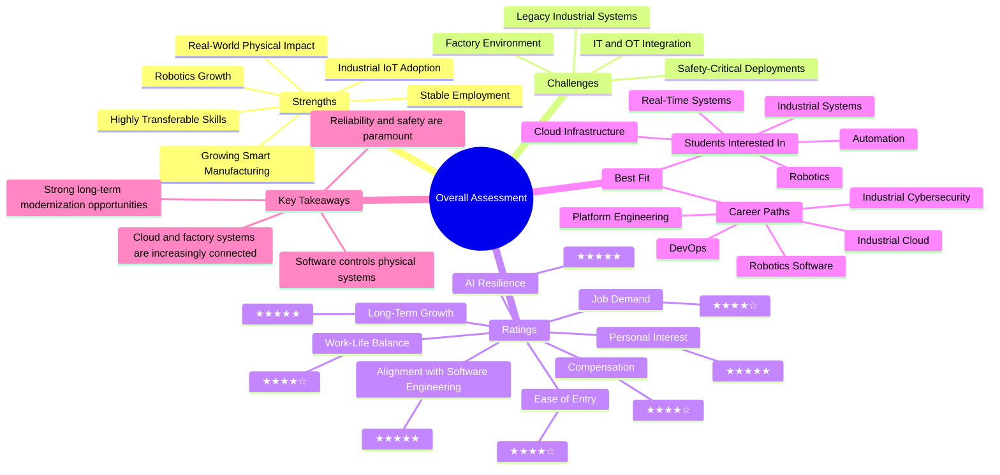

```mermaid
mindmap
    root ((Overall Assessment))
        Strengths
            Real-World Physical Impact
            Growing Smart Manufacturing
            Robotics Growth
            Industrial IoT Adoption
            Stable Employment
            Highly Transferable Skills
        Challenges
            IT and OT Integration
            Legacy Industrial Systems
            Safety-Critical Deployments
            Factory Environment
        Ratings
            Personal Interest
                ★★★★★
            Job Demand
                ★★★★☆
            Ease of Entry
                ★★★★☆
            Long-Term Growth
                ★★★★★
            Compensation
                ★★★★☆
            Work-Life Balance
                ★★★★☆
            AI Resilience
                ★★★★★
            Alignment with Software Engineering
                ★★★★★
        Best Fit
            Students Interested In
                Industrial Systems
                Cloud Infrastructure
                Robotics
                Automation
                Real-Time Systems
            Career Paths
                DevOps
                Platform Engineering
                Industrial Cloud
                Robotics Software
                Industrial Cybersecurity
        Key Takeaways
            Software controls physical systems
            Reliability and safety are paramount
            Cloud and factory systems are increasingly connected
            Strong long-term modernization opportunities
```