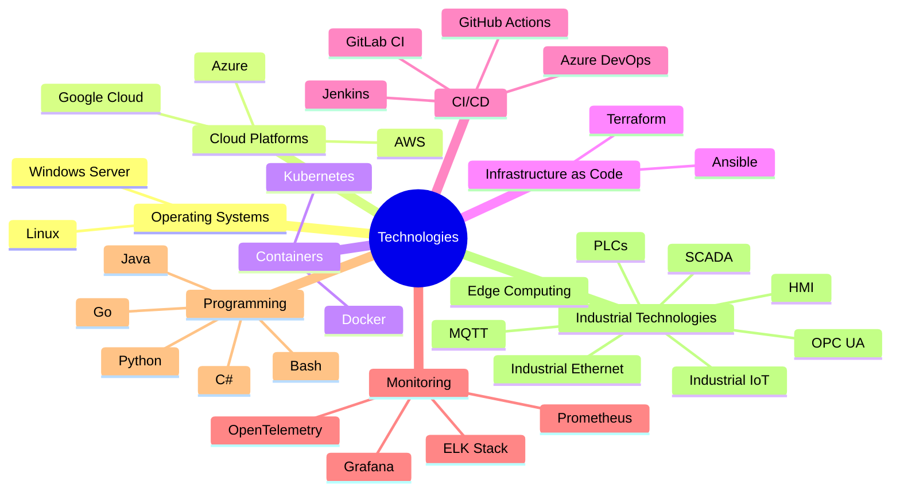

```mermaid
mindmap
    root ((Technologies))
        Operating Systems
            Linux
            Windows Server
        Cloud Platforms
            AWS
            Azure
            Google Cloud
        Containers
            Docker
            Kubernetes
        Infrastructure as Code
            Terraform
            Ansible
        CI/CD
            GitHub Actions
            GitLab CI
            Jenkins
            Azure DevOps
        Monitoring
            Prometheus
            Grafana
            ELK Stack
            OpenTelemetry
        Programming
            Python
            Go
            Java
            C#
            Bash
        Industrial Technologies
            PLCs
            SCADA
            HMI
            OPC UA
            MQTT
            Industrial Ethernet
            Industrial IoT
            Edge Computing
```