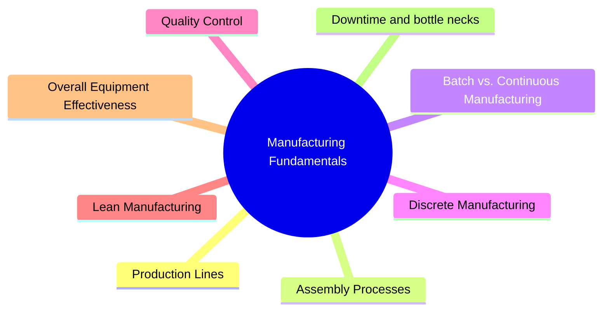

```mermaid
mindmap
    root((Manufacturing Fundamentals))

        Production Lines
        Assembly Processes
        Batch vs. Continuous Manufacturing
        Discrete Manufacturing
        Quality Control
        Lean Manufacturing
        Overall Equipment Effectiveness
        Downtime and bottle necks
```