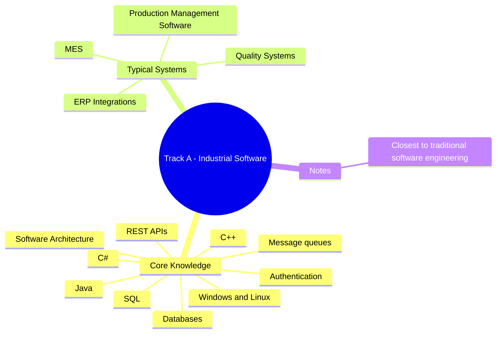

```mermaid
mindmap
    root((Track A - Industrial Software))
        Core Knowledge
            C#
            Java
            C++
            SQL
            REST APIs
            Software Architecture
            Databases
            Message queues
            Authentication
            Windows and Linux
        
        Typical Systems
            MES
            ERP Integrations
            Quality Systems
            Production Management Software

        Notes
            Closest to traditional software engineering
```