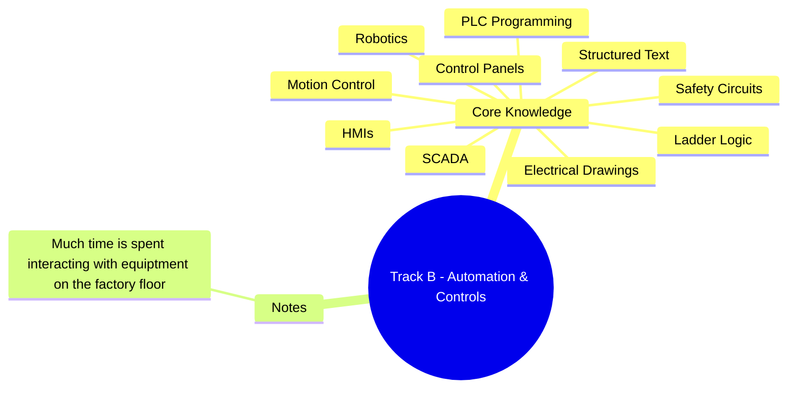

```mermaid
mindmap
    root((Track B - Automation & Controls))
        Core Knowledge
            PLC Programming
            Ladder Logic
            Structured Text
            HMIs
            SCADA
            Motion Control
            Robotics
            Electrical Drawings
            Control Panels
            Safety Circuits
        
        Notes
            Much time is spent interacting with equiptment on the factory floor
```