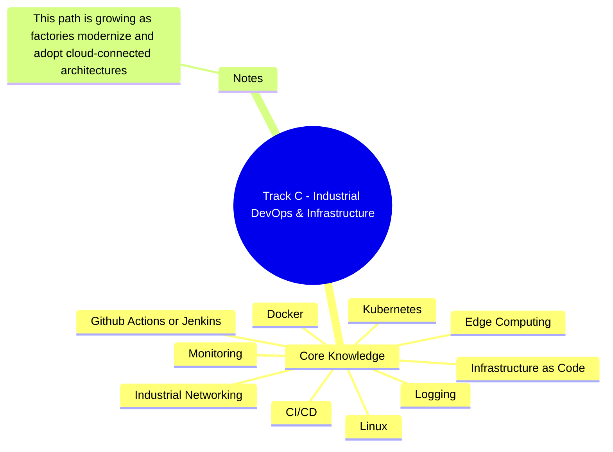

```mermaid
mindmap
    root((Track C - Industrial DevOps & Infrastructure))
        Core Knowledge
            Linux
            Docker
            Kubernetes
            CI/CD
            Github Actions or Jenkins
            Infrastructure as Code
            Monitoring
            Logging
            Edge Computing
            Industrial Networking
        
        Notes
            This path is growing as factories modernize and adopt cloud-connected architectures
```