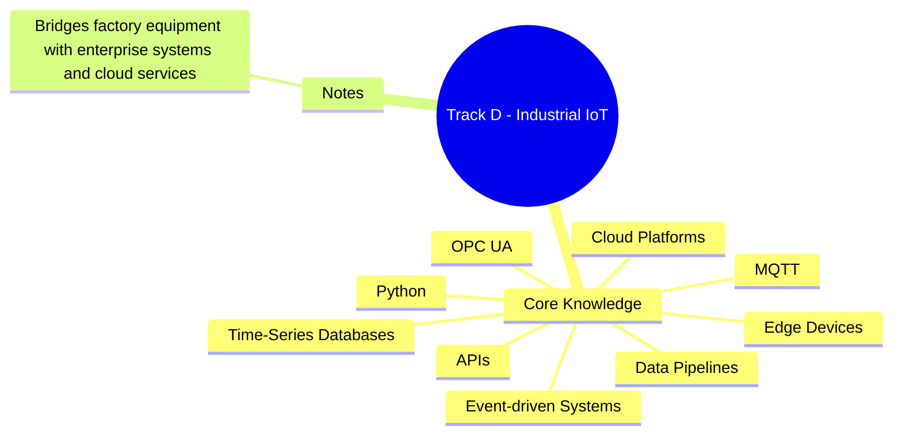

```mermaid
mindmap
    root((Track D - Industrial IoT))
        Core Knowledge
            MQTT
            OPC UA
            Edge Devices
            Cloud Platforms
            Python
            Data Pipelines
            Time-Series Databases
            APIs
            Event-driven Systems

        Notes
            Bridges factory equipment with enterprise systems and cloud services
```