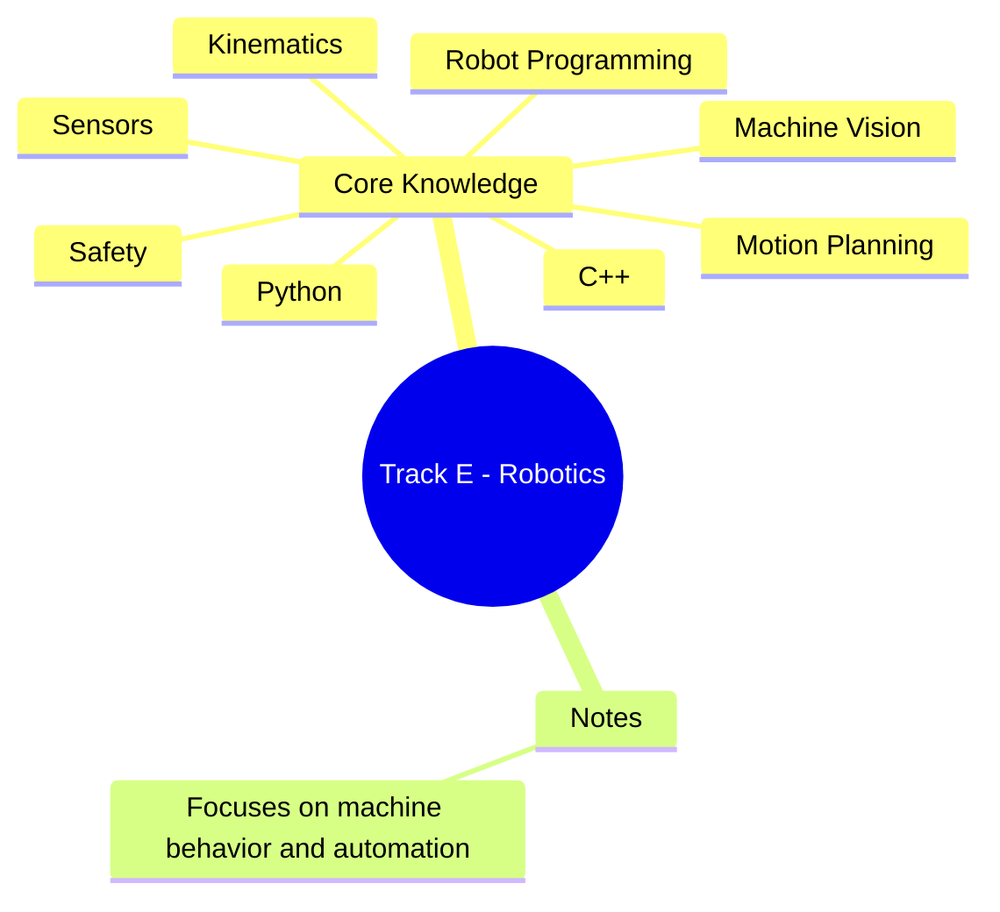

```mermaid
mindmap
    root((Track E - Robotics))
        Core Knowledge
            Robot Programming
            Kinematics
            Machine Vision
            Motion Planning
            Sensors
            Safety
            C++
            Python
        
        Notes
            Focuses on machine behavior and automation
```