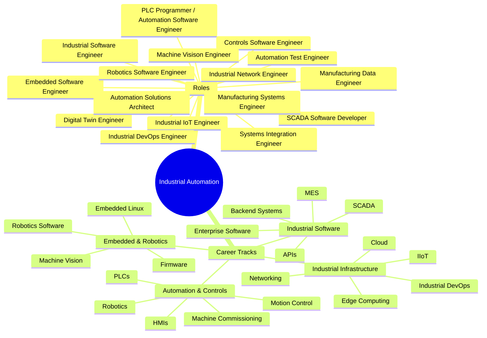

```mermaid
mindmap
    root((Industrial Automation))

        Roles
            Industrial Software Engineer
            SCADA Software Developer
            PLC Programmer / Automation Software Engineer
            Controls Software Engineer
            Industrial IoT Engineer
            Industrial DevOps Engineer
            Embedded Software Engineer
            Robotics Software Engineer
            Machine Visison Engineer
            Manufacturing Data Engineer
            Manufacturing Systems Engineer
            Industrial Network Engineer
            Automation Test Engineer
            Systems Integration Engineer
            Digital Twin Engineer
            Automation Solutions Architect
        
        Career Tracks
            Industrial Software
                MES
                SCADA
                Enterprise Software
                Backend Systems
                APIs
            Automation & Controls
                PLCs
                HMIs
                Robotics
                Motion Control
                Machine Commissioning
            Industrial Infrastructure
                Industrial DevOps
                Networking
                Cloud
                Edge Computing
                IIoT
            Embedded & Robotics
                Firmware
                Embedded Linux
                Robotics Software
                Machine Vision
```