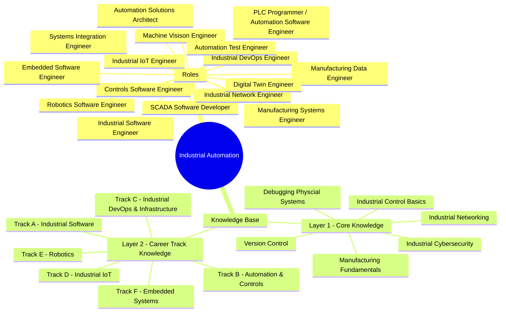

```mermaid
mindmap
    root((Industrial Automation))

        Roles
            Industrial Software Engineer
            SCADA Software Developer
            PLC Programmer / Automation Software Engineer
            Controls Software Engineer
            Industrial IoT Engineer
            Industrial DevOps Engineer
            Embedded Software Engineer
            Robotics Software Engineer
            Machine Visison Engineer
            Manufacturing Data Engineer
            Manufacturing Systems Engineer
            Industrial Network Engineer
            Automation Test Engineer
            Systems Integration Engineer
            Digital Twin Engineer
            Automation Solutions Architect
            
        Knowledge Base
            Layer 1 - Core Knowledge
                Manufacturing Fundamentals
                Industrial Control Basics
                Industrial Networking
                Industrial Cybersecurity
                Version Control
                Debugging Physcial Systems
            Layer 2 - Career Track Knowledge
                Track A - Industrial Software
                Track B - Automation & Controls
                Track C - Industrial DevOps & Infrastructure
                Track D - Industrial IoT
                Track E - Robotics
                Track F - Embedded Systems

```